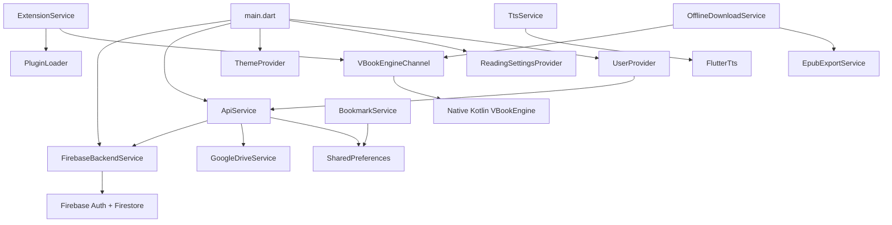

# ARCHITECTURE — vBook

> Kiến trúc kỹ thuật chi tiết, cập nhật: 2026-08-10.

## 1. Architecture Pattern

**Layered Architecture + Provider Pattern**

Không sử dụng architecture chính thức như Clean Architecture hay BLoC. Project theo mô hình phân lớp đơn giản:

```
┌─────────────────────────────────────────┐
│              Screens (UI)               │  ← StatefulWidget, trực tiếp gọi Service
├─────────────────────────────────────────┤
│          Widgets (Reusable UI)          │  ← Các component dùng lại
├─────────────────────────────────────────┤
│    Providers (State Management)         │  ← ChangeNotifier via Provider package
├─────────────────────────────────────────┤
│          Services (Business Logic)      │  ← Static methods, singleton instances
├─────────────────────────────────────────┤
│          Models (Data Layer)            │  ← PODO with fromJson/toJson
├─────────────────────────────────────────┤
│    Native Platform (Kotlin/Android)     │  ← MethodChannel bridge
└─────────────────────────────────────────┘
```

## 2. State Management

### Provider (package `provider: ^6.1.5+1`)

3 providers đăng ký trong `main.dart` qua `MultiProvider`:

| Provider                    | Vai trò                                  | Persistence         |
|-----------------------------|------------------------------------------|----------------------|
| `ThemeProvider`             | Dark/Light mode toggle                   | SharedPreferences    |
| `ReadingSettingsProvider`   | Font, bg color, line height, TTS config  | SharedPreferences    |
| `UserProvider`              | Auth state, user info, login/register    | SharedPreferences    |

### Các Singleton không qua Provider:

| Service                     | Pattern      | Mô tả                              |
|-----------------------------|-------------|--------------------------------------|
| `TtsService`                | Singleton   | Text-to-Speech, extends ChangeNotifier |
| `OfflineDownloadService`    | Singleton   | Download queue, extends ChangeNotifier |
| `AmbientAudioService`       | Singleton   | Ambient audio (stub, chưa hoàn thiện) |
| `HanVietTranslatorService`  | Singleton   | Hán-Việt translator (rất sơ khai)      |

### Service hoàn toàn static:

| Service                     | Mô tả                                           |
|-----------------------------|--------------------------------------------------|
| `ApiService`                | 2142 dòng — GOD CLASS xử lý hầu hết logic       |
| `FirebaseBackendService`    | Firebase Auth + Firestore CRUD                   |
| `GoogleDriveService`        | Google Drive API integration                     |
| `ExtensionService`          | Plugin registry, install/uninstall               |
| `BookmarkService`           | Reading progress & bookmarks (SharedPreferences) |
| `EpubExportService`         | Export story to EPUB file                        |

## 3. Luồng Khởi Động App

```
main() 
  → WidgetsFlutterBinding.ensureInitialized()
  → FirebaseBackendService.initialize()       // Init Firebase (nếu configured)
  → ApiService.initOfflineStories()           // Copy assets/offline_stories/ vào app dir
  → runApp(MultiProvider(..., child: MyApp()))
  → MyApp → MaterialApp → SplashScreen
  → Timer 1200ms → pushReplacement → HomeScreen
```

**Ghi chú:** `UserProvider._load()` được gọi trong constructor, tự động restore session và `refreshSession()`.

## 4. Luồng Authentication

```
┌─── REGISTER ──────────────────────────────────────────────┐
│ UserProvider.registerWithBackend()                         │
│   → ApiService.registerWithBackend()                      │
│     → FirebaseBackendService.register() [nếu có Firebase]  │
│     → HOẶC _registerLocalAccount() [nếu offline]           │
│     → _saveLocalBackupAccount() + _saveAuthSession()       │
│     → syncPendingCloudData() [background]                  │
│   → _setBackendUser() → mergeCloudLibraryIntoLocal()       │
└────────────────────────────────────────────────────────────┘

┌─── LOGIN ─────────────────────────────────────────────────┐
│ UserProvider.loginWithBackend()                            │
│   → ApiService.loginWithBackend()                         │
│     → FirebaseBackendService.login() [nếu có Firebase]     │
│     → HOẶC _loginLocalAccount() [nếu offline/error]        │
│     → _saveAuthSession()                                   │
│   → _setBackendUser() → mergeCloudLibraryIntoLocal()       │
└────────────────────────────────────────────────────────────┘
```

**Đặc điểm:**
- Hỗ trợ offline accounts lưu trong SharedPreferences (kèm password plaintext)
- Email verification qua Firebase link
- Auto-merge cloud library vào local khi login
- Admin role: hardcoded check email + Firestore role field

## 5. Luồng Lấy & Lưu Dữ Liệu

### 5.1 Thư viện cá nhân (Personal Stories)
```
ApiService.fetchPersonalStories()
  → SharedPreferences.getStringList('local_imported_stories')
  → _repairMissingLocalEpubCovers() // Tự fix cover nếu mất
  → return List<Story>
```

### 5.2 Truyện từ Drive (Server Stories)
```
ApiService.fetchServerStories()
  → _fetchDriveStoriesAndCache()
    → Check cache TTL (30 phút)
    → GoogleDriveService.fetchStoriesFromConfiguredFolder()
      → _listChildren(folderId) // Drive API v3
      → Tìm catalog.json hoặc scan subfolder
    → Cache vào SharedPreferences
```

### 5.3 Cloud sync (Firebase)
```
FirebaseBackendService.syncStoryToLibrary()    // Lưu lên Firestore
FirebaseBackendService.syncProgress()          // Lưu tiến độ đọc
FirebaseBackendService.fetchCloudLibraryStories() // Đọc từ Firestore
```

### 5.4 Reading Progress
```
BookmarkService.saveProgress()      // Debounced 500ms → SharedPreferences
ApiService.saveChapterProgress()    // Local + Cloud sync
ApiService.saveScrollOffset()       // Debounced 600ms
```

## 6. Luồng Extension/Source

```
┌─── INSTALL ───────────────────────────────────────────┐
│ ExtensionService.installPlugin(PluginInfo)             │
│   → PluginLoader.installPlugin(zipUrl, pluginId)      │
│     → HTTP GET zip file                                │
│     → extractZipFile() → vbook_plugins/<pluginId>/     │
│   → VBookEngineChannel.loadSource(id, dirPath)         │
│     → MethodChannel → MainActivity.kt                 │
│       → JsLoader.loadAndValidate(path)                │
│       → VBookEngine.loadSource(config)                │
│   → Save to SharedPreferences                          │
└───────────────────────────────────────────────────────┘

┌─── BROWSE ────────────────────────────────────────────┐
│ VBookEngineChannel.getPopularManga(id, page)          │
│   → MethodChannel('com.vbook.reader/vbook_engine')    │
│     → VBookEngine.getPopularManga()                   │
│       → JsSource.getPopularManga()                    │
│         → JsEnvironment.evaluate(JS script)           │
│         → HTTP fetch qua CookieJar + OkHttp           │
│   → Parse JSON → MangasPage(List<SManga>, hasNext)    │
└───────────────────────────────────────────────────────┘
```

**Plugin structure (trên disk):**
```
vbook_plugins/<pluginId>/
├── plugin.json          # Metadata + script paths
└── src/
    ├── home.js          # Trang chủ / danh sách
    ├── detail.js        # Chi tiết truyện
    ├── toc.js           # Mục lục
    ├── chap.js          # Nội dung chương
    ├── search.js        # Tìm kiếm
    └── gen.js           # Category listing
```

## 7. Luồng Đọc Sách

### 7.1 Local Reader
```
StoryDetailScreen → nhấn "Đọc"
  → EPUB: EpubReaderScreen (epub_view package)
  → PDF: PdfReaderScreen (syncfusion_flutter_pdfviewer)
  → TXT: ReadingScreen (custom ScrollView)
  → Chapter-based: ChapterReaderScreen (custom reader)
```

### 7.2 Online Reader (Extension)
```
SourceBrowseScreen → chọn truyện
  → OnlineStoryDetailScreen (hiển thị detail + chapter list)
    → OnlineChapterReaderScreen (đọc nội dung chapter)
      → VBookEngineChannel.getPageList()
        → Novel: hiển thị text
        → Comic: hiển thị danh sách ảnh
```

## 8. Luồng TTS

```
TtsService.speak(text)
  → _splitTextIntoChunks(text)   # Split tại sentence boundary, max 2000 chars
  → _safeSpeak(chunk[0])         # FlutterTts.speak()
  → CompletionHandler:
    → Nếu còn chunk → speak chunk tiếp theo
    → Nếu hết → onChapterComplete callback → tự chuyển chương
  → Controls: pause/resume/stop/nextChunk/previousChunk
  → Sleep timer: Timer.periodic(1 min) → auto stop
```

## 9. Quan Hệ Giữa Các Service



## 10. Dependencies Quan Trọng

| Package                         | Vai trò                          | Rủi ro |
|---------------------------------|----------------------------------|--------|
| `provider: ^6.1.5+1`           | State management                 | Thấp   |
| `firebase_core/auth/firestore`  | Authentication & cloud sync     | Trung bình |
| `epub_view: ^3.2.0`            | EPUB rendering                   | Thấp   |
| `syncfusion_flutter_pdfviewer`  | PDF rendering                   | Thấp   |
| `flutter_tts: ^4.2.0`          | Text-to-speech                  | Trung bình |
| `flutter_js: ^0.8.2`           | UNUSED (native engine thay thế) | Có thể remove |
| `webview_flutter: ^4.14.1`     | WebBrowserScreen                | Trung bình |
| `cached_network_image: ^3.4.1` | Image caching                   | Thấp   |
| `archive: ^3.6.1`              | ZIP extract cho plugins + EPUB   | Thấp   |
| `http: ^1.6.0`                 | HTTP requests                    | Thấp   |
| `shared_preferences: ^2.5.5`   | Local persistence                | Thấp   |
| `google_fonts: ^6.2.1`         | Custom fonts for reader          | Thấp   |
| `photo_view: ^0.15.0`          | Image zoom cho comic reader     | Thấp   |
| `share_plus: ^10.0.3`          | Share functionality              | Thấp   |

## 11. Native Code (Android/Kotlin)

```
android/app/src/main/kotlin/com/vbook/reader/
├── MainActivity.kt              # MethodChannel handler (vbook_engine)
├── vbook_engine/
│   ├── VBookEngine.kt           # Core engine, manage sources
│   └── JsEnvironment.kt         # Duktape/QuickJS JS execution environment
├── loader/
│   └── JsLoader.kt              # Load & validate plugin from disk
├── model/
│   └── PluginConfig.kt          # Kotlin model for plugin.json
└── source/
    └── JsSource.kt              # Execute JS scripts for data fetching
```

**Giao tiếp Flutter ↔ Kotlin:** `MethodChannel('com.vbook.reader/vbook_engine')`

Các method:
- `loadSource(id, dirPath)`
- `getPopularManga(id, page)`
- `getLatestUpdates(id, page)`
- `getSearchManga(id, query, page)`
- `getMangaDetails(id, url)`
- `getChapterList(id, url)`
- `getPageList(id, url)`
- `getHomeTabs(id)`
- `getMangaListByTab(id, input, script, page)`
- `closeSource(id)`
